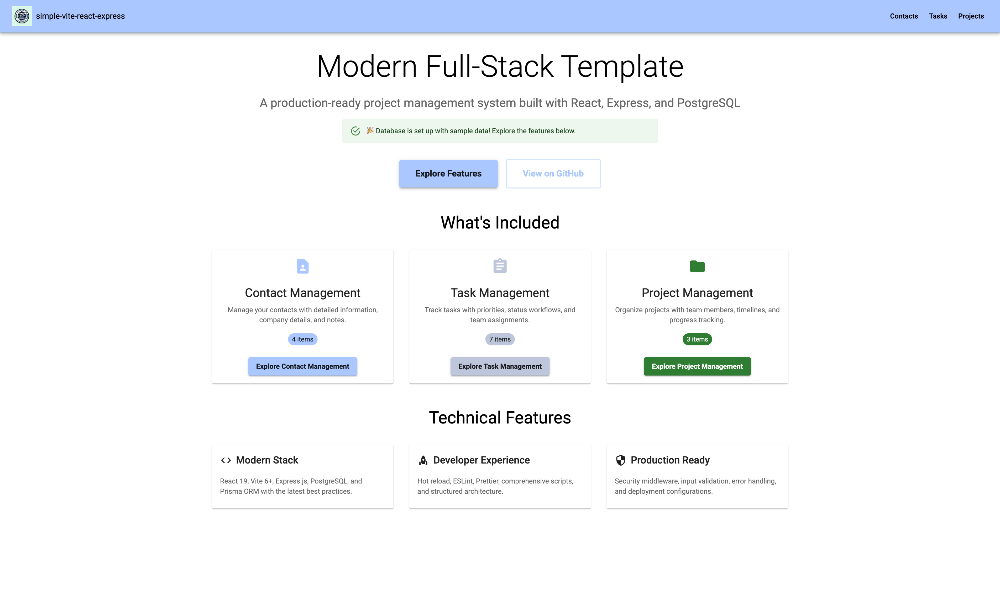
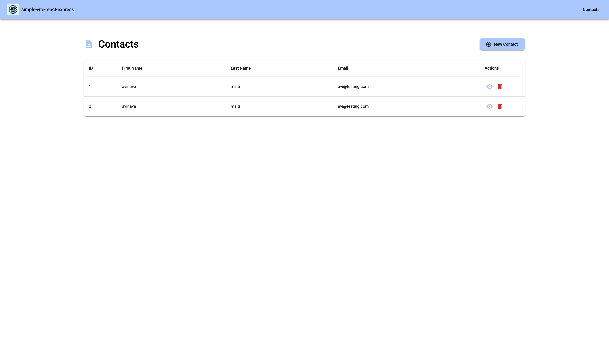
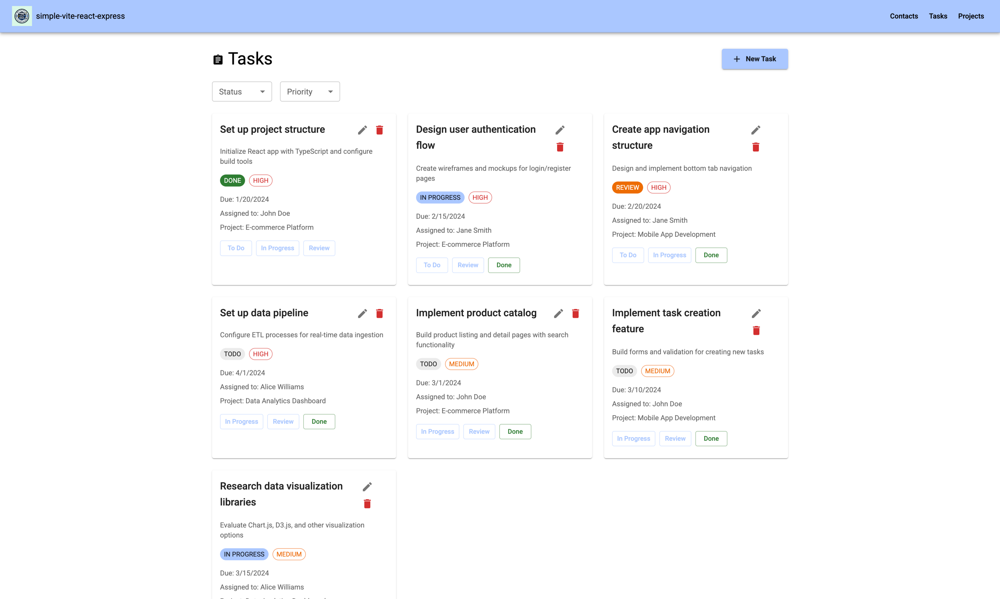
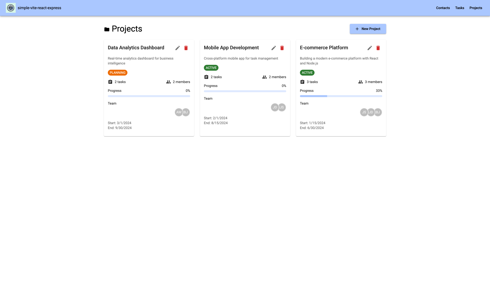
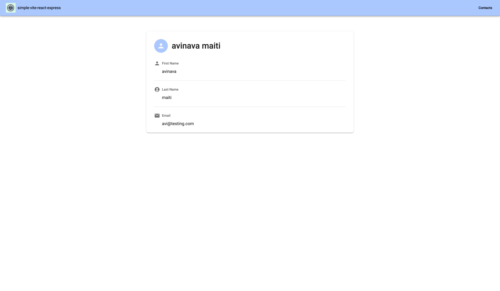
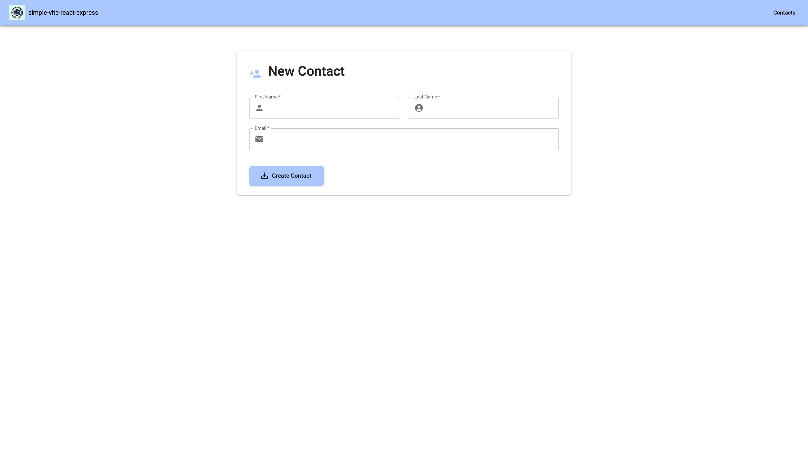
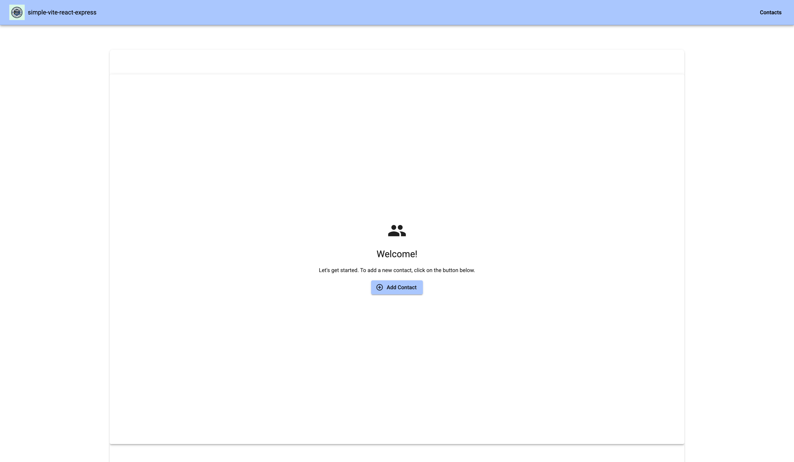

# Simple Vite React Express

<p align="center">
  
</p>

<p align="center">
    
    
    
    
    
    <br>
    
    
    
    
    
</p>

A full-stack starter template with working examples instead of empty files. I built this because I was tired of cloning repos with just authentication and a "Hello World" - this one has actual CRUD operations, relationships, and form handling so you can see how things connect together.

<div align="center">

</div>

## Quick Start

```bash
# Clone and setup your project
git clone git@github.com:Avinava/simple-vite-react-express.git your-project-name
cd your-project-name

# Install dependencies (npm, yarn, or pnpm)
npm install
# or
yarn install
# or
pnpm install

# Environment setup
cp example.env .env
# Edit .env with your database credentials

# Database initialization
npm run db:setup
# or manually:
# npx prisma migrate dev
# npx prisma generate

# Start development servers
npm run dev
```

Open [http://localhost:3000](http://localhost:3000) and you'll see what I mean. Instead of placeholder content, you get:
- Contact management (create, edit, delete, view details)
- Task tracking with status changes and priorities
- Project organization with member assignments
- Material-UI components that actually do something
- PostgreSQL with foreign keys and relationships working

It's basically a simple CRM to demonstrate how the pieces fit together. Good for learning or as a starting point for something bigger.

## What This Demonstrates

### Actual Working Features
Most starter templates have a login page and then... nothing. Here you can immediately see how CRUD operations work, how forms connect to the backend, how to handle validation errors, and how the database relationships actually function. It's the stuff you usually have to figure out yourself.

### Common Patterns You'll Need
The code shows how to structure a multi-model application: contacts, tasks, and projects with relationships between them. You can see how to handle one-to-many (contact has many tasks) and many-to-many (projects have many contacts) relationships. Plus practical things like status enums, optional fields, and proper foreign keys.

### Full Stack Integration
The frontend and backend actually talk to each other properly. API routes that return consistent response formats, error handling that shows meaningful messages, form validation on both client and server. You can see the complete data flow instead of guessing how pieces connect.

### Development Setup That Works
Everything is configured to work together from the start. Vite for fast frontend builds, Nodemon for backend auto-restart, Prisma for database management, and proper environment handling. No hunting for the right configuration or fighting with build tools.

## Project Structure

```
├── src/
│   ├── client/              # Frontend (React + Vite)
│   │   ├── components/      # Reusable UI components
│   │   ├── pages/           # Route-based page components
│   │   ├── hooks/           # Custom React hooks
│   │   ├── utils/           # Client-side utilities
│   │   └── theme/           # Material-UI theme config
│   │
│   └── server/              # Backend (Express + Node.js)
│       ├── routes/          # API route definitions
│       ├── services/        # Business logic layer
│       ├── middleware/      # Express middleware
│       ├── utils/           # Server utilities
│       └── config/          # Configuration files
│
├── prisma/                  # Database (Prisma ORM)
│   ├── schema.prisma        # Database schema
│   ├── migrations/          # Database migrations
│   └── seed.js              # Database seeding
│
├── docs/                    # Documentation
├── public/                  # Static assets
└── scripts/                 # Build & deployment scripts
```

## Available Scripts

### Development

```bash
npm run dev          # Start both client and server
npm run client       # Start only frontend (Vite)
npm run server       # Start only backend (Nodemon)
npm run preview      # Preview production build
```

### Database

```bash
npm run db:setup     # Initialize database (migrate + generate)
npm run db:migrate   # Run database migrations
npm run db:generate  # Generate Prisma client
npm run db:studio    # Open Prisma Studio
npm run db:reset     # Reset database
npm run db:seed      # Seed database with sample data
```

### Code Quality

```bash
npm run lint         # Check code quality
npm run lint:fix     # Fix linting issues
npm run format       # Format code with Prettier
npm run format:check # Check code formatting
```

### Production

```bash
npm run build        # Build for production
npm start            # Start production server
```

## Template Features

### Frontend

- Vite 6+ for lightning fast builds and HMR
- React 19 with latest concurrent features
- Material-UI v6 with theme customization
- Formik + Yup for form handling and validation
- React Router v7 for client-side routing
- Axios for HTTP requests
- ESLint + Prettier for code quality
- Responsive design with mobile-first approach

### Backend

- Express.js minimalist web framework
- Prisma ORM with type-safe database client and migrations
- Security middleware - Helmet, rate limiting, CORS protection
- Structured architecture with routes, services, middleware separation
- Environment configuration management
- Input validation with Celebrate/Joi schemas
- Clean business logic separation with service layer
- Standardized API response format
- Hot reload with automatic server restart via Nodemon
- Performance optimizations with compression and caching headers

### Development & Deployment

- Modern tooling with latest versions of all dependencies
- Docker support with multi-stage builds for production
- Platform ready for Vercel, Railway, Render, Heroku
- Database seeding with sample data for quick development
- Code quality tools - ESLint, Prettier, and best practices
- Comprehensive guides and examples

## Making It Your Own

### Basic Customization
Change the app name in `package.json`, swap out the logo in `/public/template-logo.png`, and update the title in `index.html`. The theme colors are in `src/client/theme/theme.js` if you want to change the look.

### Database Changes
The schema in `prisma/schema.prisma` has three example models. You can modify them, add new ones, or delete what you don't need. Just run `npm run db:migrate` after changes. The current setup shows how relationships work if you need that pattern.

### Adding Features
The existing code structure makes it pretty straightforward to add new features. Look at how the contact routes are set up in `src/server/routes/v1/contact.route.js` and the corresponding service in `src/server/services/contact.service.js`. Copy that pattern for new functionality.

### Deployment
For production, you'll need to set up a PostgreSQL database somewhere and update the `DATABASE_URL` in your environment. The app is configured to serve the built frontend from the Express server, so a single deploy should work on most platforms.

## API Overview

All API endpoints are prefixed with `/api/v1/` and follow RESTful conventions.

### Contact Management
```bash
GET    /contact/list     # Get all contacts
GET    /contact/:id      # Get specific contact  
POST   /contact          # Create new contact
PUT    /contact/:id      # Update contact
DELETE /contact/:id      # Delete contact
```

### Task Management  
```bash
GET    /task/list        # Get all tasks
GET    /task/:id         # Get specific task
POST   /task             # Create new task
PUT    /task/:id         # Update task
DELETE /task/:id         # Delete task
```

### Project Management
```bash
GET    /project/list     # Get all projects
GET    /project/:id      # Get specific project
POST   /project          # Create new project
PUT    /project/:id      # Update project
DELETE /project/:id      # Delete project
```

### Health Check
```bash
GET    /health           # Server status check
```

All endpoints return standardized JSON responses:
```javascript
{
  "success": boolean,    // Operation status
  "data": any,          // Response payload  
  "message": string,    // Human-readable message
  "timestamp": string   // ISO timestamp
}
```

## Example Features

The template includes a comprehensive project management system demonstrating:

### 📋 Contact Management

- Full CRUD operations with enhanced contact fields
- Email uniqueness validation
- Company and notes tracking
- Phone number management

### 📊 Project Management

- Project creation with status tracking
- Team member assignment with roles
- Project timeline management
- Member management (add/remove)

### ✅ Task Management

- Task creation with priority levels
- Status workflow (TODO → IN_PROGRESS → REVIEW → DONE)
- Task assignment to team members
- Due date tracking and filtering
- Project-based task organization

### 🔗 Relationship Management

- Many-to-many relationships between contacts and projects
- One-to-many relationships for task assignments
- Proper foreign key constraints and cascading deletes

### 🛠️ Technical Demonstrations

- Advanced Prisma schema with enums and relationships
- Complex database queries with joins and filtering
- Service layer architecture for business logic
- Comprehensive input validation with Joi
- Standardized API responses
- Error handling and edge cases

## Screenshots

Here's what you get when you run it:

<div align="center">

### Contact Management


### Task Management


### Project Management


### Contact Details


### Form Handling


### Empty States


</div>

You can see how data tables work with edit/delete actions, form validation in practice, and how to handle empty states. It's all functional, not just mock-ups.

## Contributing

1. Fork the repository
2. Create a feature branch
3. Make your changes
4. Run tests and linting
5. Submit a pull request

## License

MIT License - see LICENSE file for details.
