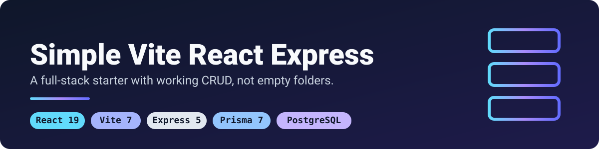
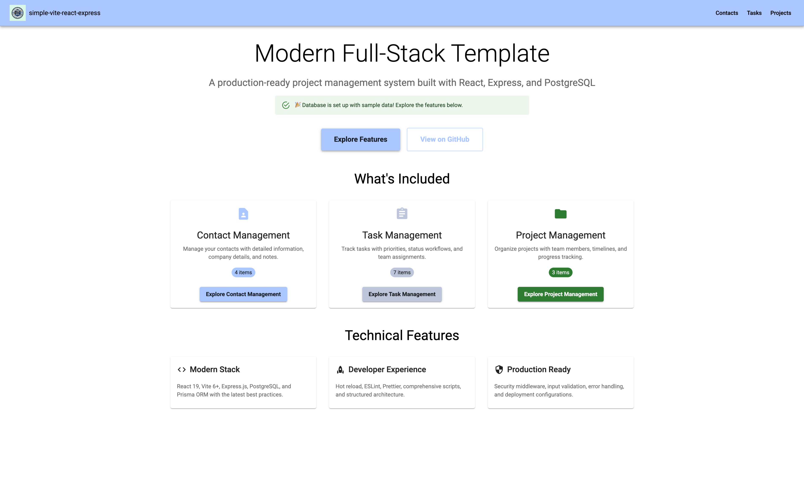
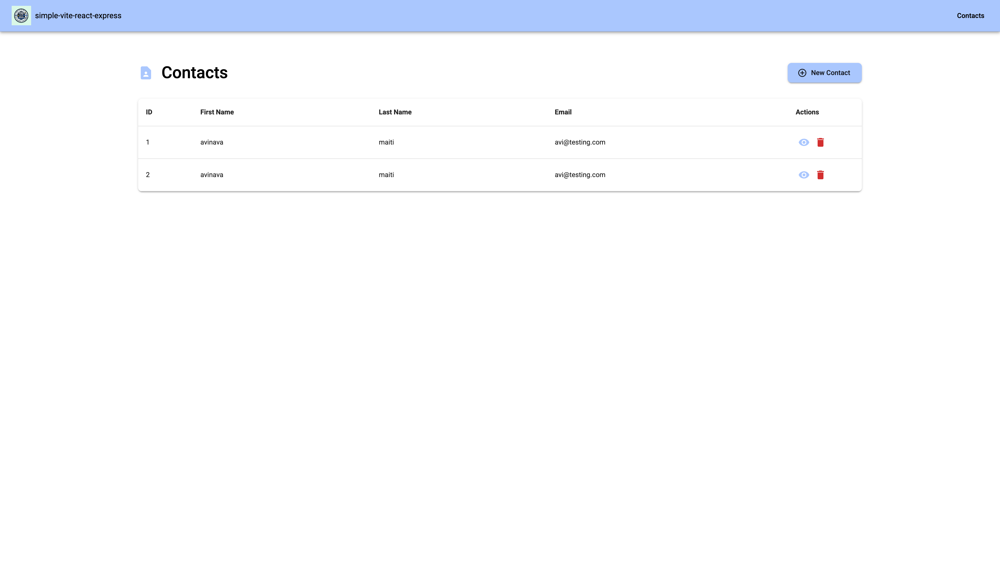
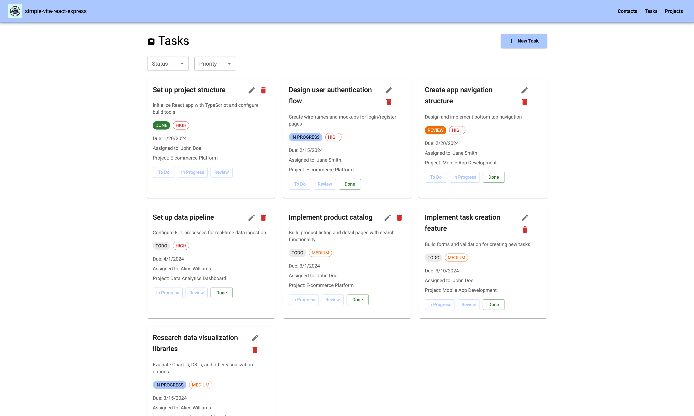
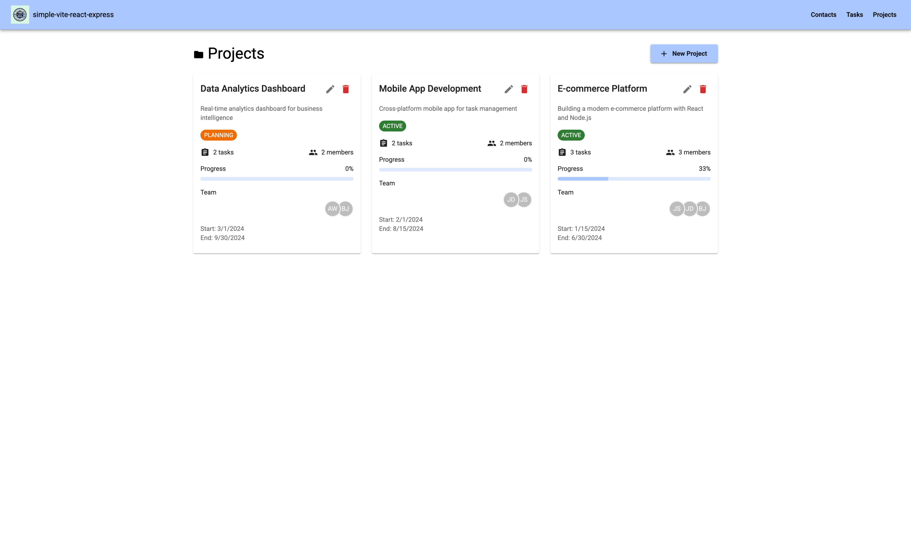

<p align="center">
  
</p>

<p align="center">
  <a href="https://github.com/Avinava/simple-vite-react-express/actions/workflows/ci.yml"></a>
  
  
  
  
  
  
  
</p>

> [!TIP]
> **Starting something new?** The successor, [`agentic-react-express-ts`](https://github.com/Avinava/agentic-react-express-ts), is this stack in TypeScript with tRPC and pre-wired guardrails. This repo stays maintained as the simple JavaScript version. [Migration guide](docs/migrating-to-agentic.md).

A full-stack starter with **working examples**, not empty folders: real CRUD, database relationships,
forms with validation, and a clean layered structure you can read in an afternoon.

**Version 2.2** · [Changelog](CHANGELOG.md) · [Docs](docs/getting-started.md)

## Quick Start

You need **Node.js 22+** and a running **PostgreSQL** ([no Postgres? see options](docs/getting-started.md#1-prerequisites)).

```bash
npx degit Avinava/simple-vite-react-express my-project
cd my-project
npm install

cp example.env .env        # then set DATABASE_URL in .env
createdb simple-vite-db    # skip if the database already exists
npm run db:setup           # migrations + Prisma client
npm run db:seed            # optional sample data
npm run dev
```

Open <http://localhost:3000>. The API runs on <http://localhost:8080/api/v1>.

Something not working? See [Troubleshooting](docs/troubleshooting.md).

## What's inside

A small CRM that shows the patterns you'll reuse:

- **Contacts**: full CRUD with Formik + Yup forms
- **Tasks**: status workflow, assigned to contacts
- **Projects**: many-to-many team membership
- **Plumbing**: health check, toasts, error handling, security headers, rate limiting, tests

```
Browser ─► React 19 + MUI 7 ─► Express 5 ─► Prisma 7 ─► PostgreSQL
Client: Pages → Hooks → Services → Axios      Server: Routes → Services → Prisma
```

More in [Architecture](docs/architecture.md) and the [API reference](docs/api.md).

## Scripts

| Command | What it does |
|---------|--------------|
| `npm run dev` | Client and server together |
| `npm run build` / `npm start` | Production build / run |
| `npm run db:setup` | Migrate + generate Prisma client |
| `npm run db:seed` | Load sample data |
| `npm run db:studio` | Prisma Studio GUI |
| `npm run db:reset` | Drop and re-create the database schema |
| `npm run test:run` | Tests once (`npm test` for watch) |
| `npm run lint` / `npm run format` | ESLint / Prettier |

## Tech stack

| Layer | Tools |
|-------|-------|
| Client | React 19, Vite 7, MUI 7, React Router 7, Formik + Yup, Axios, react-toastify |
| Server | Express 5, Prisma 7 (pg adapter), celebrate/Joi, Helmet, express-rate-limit |
| Quality | ESLint 9 (flat config), Prettier, Vitest 4, React Testing Library, GitHub Actions CI |

## Screenshots

<div align="center">
  
  
  
  
</div>

## Using it as your own project

Rename the project, swap the logo and theme, replace the demo models, then delete what you don't need.
The checklist lives in [Getting Started](docs/getting-started.md#make-it-yours) and
[Architecture](docs/architecture.md#removing-the-demo).

Using an AI coding agent? [AGENTS.md](AGENTS.md) describes the conventions.

## Contributing

Small, focused PRs welcome. See [CONTRIBUTING.md](CONTRIBUTING.md). Security issues: [SECURITY.md](SECURITY.md).

## License

[MIT](LICENSE)
