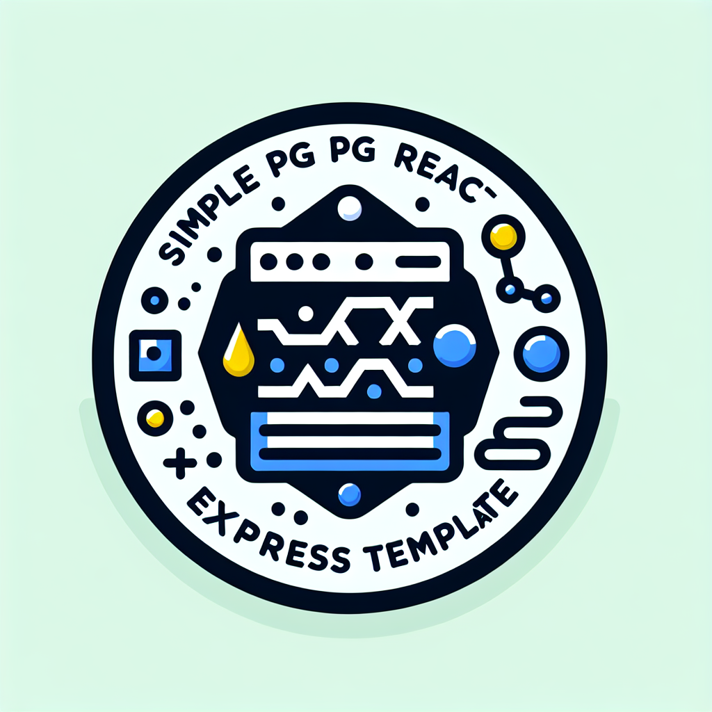

# simple-vite-react-express

<p align="center">
  
</p>

<p align="center">
    
    
    
    
    
    <br>
    
    
    
    
    
</p>

Full-stack template with modern tooling, best practices, and developer experience optimizations. Built for rapid prototyping and scalable applications.

## Quick Start

```bash
# Clone and setup your project
git clone git@github.com:Avinava/simple-vite-react-express.git your-project-name
cd your-project-name

# Install dependencies (npm, yarn, or pnpm)
npm install
# or
yarn install
# or
pnpm install

# Environment setup
cp example.env .env
# Edit .env with your database credentials

# Database initialization
npm run db:setup
# or manually:
# npx prisma migrate dev
# npx prisma generate

# Start development servers
npm run dev
```

> Ready in 2 minutes! The template includes hot reload, database setup, and example CRUD operations.

## What's New in 2025

### Major Updates

- **React 19** - Latest React with concurrent features and improved performance
- **Vite 6+** - Faster builds, improved HMR, and better dev experience
- **Material-UI v6** - Latest component library with enhanced theming
- **Modern Tooling** - ESLint 8+, Prettier 3+, updated dependencies
- **Docker Support** - Production-ready containerization
- **Enhanced Scripts** - Better DX with comprehensive npm scripts
- **Security Updates** - Latest security middleware and best practices

### Developer Experience

- **Code Quality** - ESLint + Prettier configuration
- **Database Tools** - Enhanced Prisma scripts for better workflow
- **Hot Reload** - Both client and server with automatic restarts
- **Type Safety** - TypeScript-ready configuration

## Project Structure

```
├── src/
│   ├── client/              # Frontend (React + Vite)
│   │   ├── components/      # Reusable UI components
│   │   ├── pages/           # Route-based page components
│   │   ├── hooks/           # Custom React hooks
│   │   ├── utils/           # Client-side utilities
│   │   └── theme/           # Material-UI theme config
│   │
│   └── server/              # Backend (Express + Node.js)
│       ├── routes/          # API route definitions
│       ├── services/        # Business logic layer
│       ├── middleware/      # Express middleware
│       ├── utils/           # Server utilities
│       └── config/          # Configuration files
│
├── prisma/                  # Database (Prisma ORM)
│   ├── schema.prisma        # Database schema
│   ├── migrations/          # Database migrations
│   └── seed.js              # Database seeding
│
├── docs/                    # Documentation
├── public/                  # Static assets
└── scripts/                 # Build & deployment scripts
```

## Available Scripts

### Development

```bash
npm run dev          # Start both client and server
npm run client       # Start only frontend (Vite)
npm run server       # Start only backend (Nodemon)
npm run preview      # Preview production build
```

### Database

```bash
npm run db:setup     # Initialize database (migrate + generate)
npm run db:migrate   # Run database migrations
npm run db:generate  # Generate Prisma client
npm run db:studio    # Open Prisma Studio
npm run db:reset     # Reset database
npm run db:seed      # Seed database with sample data
```

### Code Quality

```bash
npm run lint         # Check code quality
npm run lint:fix     # Fix linting issues
npm run format       # Format code with Prettier
npm run format:check # Check code formatting
```

### Production

```bash
npm run build        # Build for production
npm start            # Start production server
```

## Template Features

### Frontend

- ⚡️ **Vite 6+** - Lightning fast build tool with HMR
- ⚛️ **React 19** - Latest React with concurrent features
- 🎨 **Material-UI v6** - Modern component library with theme customization
- 📝 **Formik + Yup** - Robust form handling and validation
- 🚦 **React Router v7** - Client-side routing with data loading
- 🔄 **Axios** - Promise-based HTTP client
- 🎯 **ESLint + Prettier** - Code quality and formatting
- 📱 **Responsive Design** - Mobile-first approach

### Backend

- 📡 **Express.js** - Fast, minimalist web framework
- 🗄️ **Prisma ORM** - Type-safe database client with migrations
- 🔐 **Security First** - Helmet, rate limiting, CORS protection
- 📝 **Structured Architecture** - Routes, services, middleware separation
- 🔧 **Environment Config** - Secure configuration management
- ✅ **Input Validation** - Celebrate/Joi schema validation
- 🚦 **Service Layer** - Clean business logic separation
- 📊 **Standardized Responses** - Consistent API response format
- 🔄 **Hot Reload** - Automatic server restart with Nodemon
- 📈 **Performance Optimized** - Compression, caching headers

### Development & Deployment

- 🔧 **Modern Tooling** - Latest versions of all dependencies
- 🐳 **Docker Support** - Multi-stage builds for production
- 🚀 **Platform Ready** - Vercel, Railway, Render, Heroku support
- 📊 **Database Seeding** - Sample data for quick development
- 🔍 **Code Quality** - ESLint, Prettier, and best practices
- 📚 **Documentation** - Comprehensive guides and examples

## First Steps After Cloning

### 1. Project Setup

- [ ] Update `package.json` (name, version, description, repository)
- [ ] Update README.md with your project details
- [ ] Configure Git remote: `git remote set-url origin your-repo-url`
- [ ] Review and update LICENSE file

### 2. Environment Configuration

- [ ] Copy `example.env` to `.env`
- [ ] Set up PostgreSQL database and update `DATABASE_URL`
- [ ] Configure `PORT` and `NODE_ENV`
- [ ] Add any additional environment variables

### 3. Database Setup

- [ ] Review `prisma/schema.prisma`
- [ ] Modify or remove the example Contact model
- [ ] Add your own models and relationships
- [ ] Run `npm run db:setup`

### 4. Frontend Customization

- [ ] Update title and meta tags in `index.html`
- [ ] Replace logo and favicon in `/public`
- [ ] Modify theme in `src/client/theme/theme.js`
- [ ] Update Header component with your app name
- [ ] Plan and implement your route structure

## API Response Format

All API endpoints return responses in a standardized format:

```javascript
{
  "success": boolean,    // Operation status
  "data": any,          // Response payload
  "message": string,    // Human-readable message
  "timestamp": string   // ISO timestamp
}
```

## Example Features

The template includes a comprehensive project management system demonstrating:

### 📋 Contact Management

- Full CRUD operations with enhanced contact fields
- Email uniqueness validation
- Company and notes tracking
- Phone number management

### 📊 Project Management

- Project creation with status tracking
- Team member assignment with roles
- Project timeline management
- Member management (add/remove)

### ✅ Task Management

- Task creation with priority levels
- Status workflow (TODO → IN_PROGRESS → REVIEW → DONE)
- Task assignment to team members
- Due date tracking and filtering
- Project-based task organization

### 🔗 Relationship Management

- Many-to-many relationships between contacts and projects
- One-to-many relationships for task assignments
- Proper foreign key constraints and cascading deletes

### 🛠️ Technical Demonstrations

- Advanced Prisma schema with enums and relationships
- Complex database queries with joins and filtering
- Service layer architecture for business logic
- Comprehensive input validation with Joi
- Standardized API responses
- Error handling and edge cases

## Screenshots

<details>
<summary>📸 View Application Screenshots</summary>

### Homepage


### Contacts Overview


### Contact List


### Contact Details


### New Contact Form


</details>

## Contributing

1. Fork the repository
2. Create a feature branch
3. Make your changes
4. Run tests and linting
5. Submit a pull request

## License

MIT License - see LICENSE file for details.
